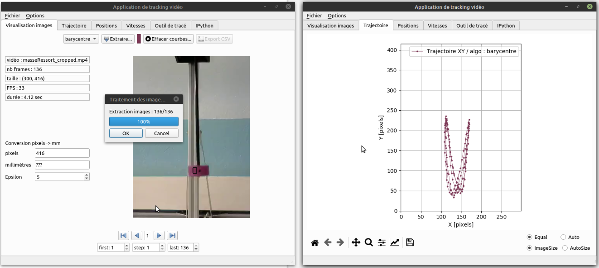
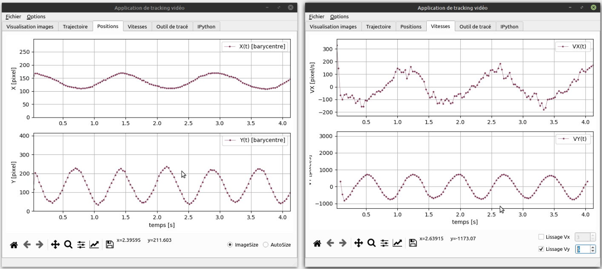
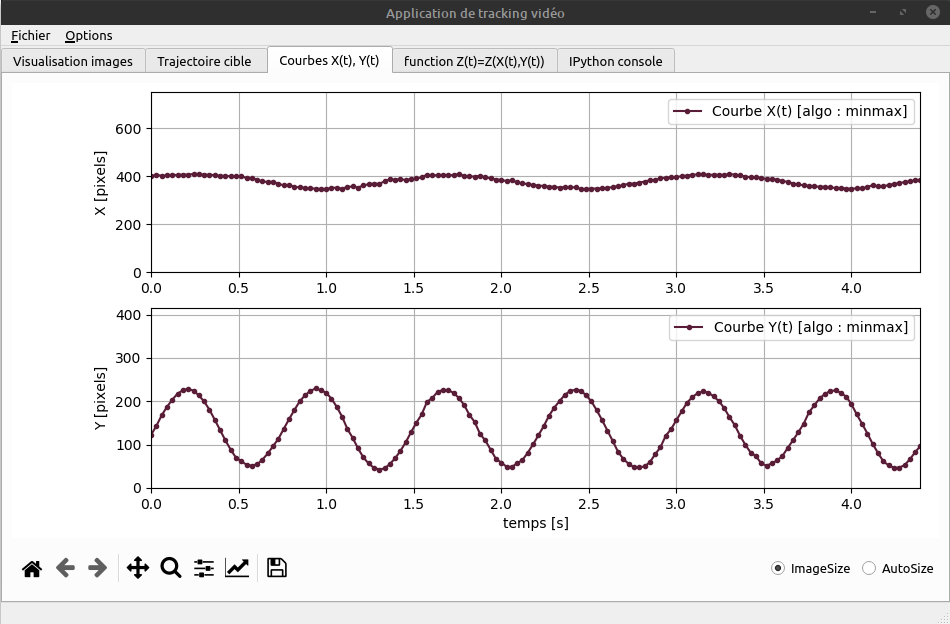
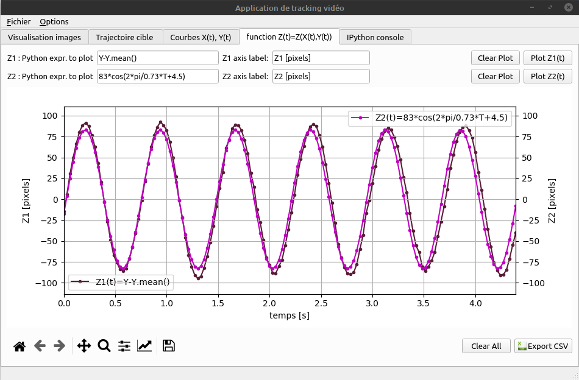
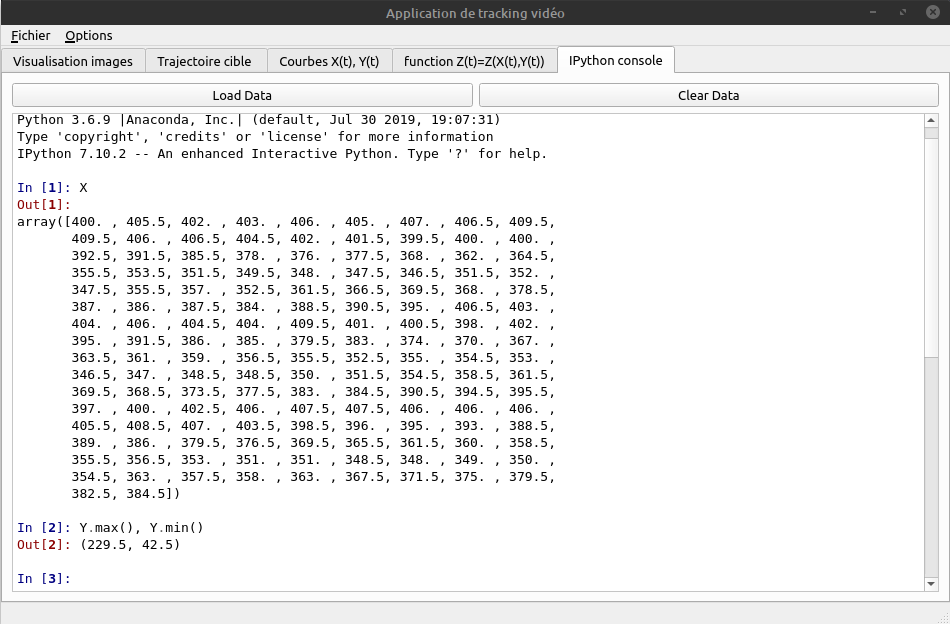

# VideoTracker
### A software designed to extract a target trajectory from a video, based on selected pixels RGB color.
The MP4 video is splitted as image files (PNG format). The user can move forward-backward through the images to choose an image where he sees the target : he can then select a rectangular zone of target pixels to indicate the target color. 
The software then scans all the images, finds out the set of pixels that have the right color (+/- epsilon), and computes the center gravity or the min/max... of the pixels in the set, giving a pair (X,Y) for each image.
The curves X(t), Y(t) and Y(X) are drawn in different tabs.

### Images tab

### Trajectory tab

### X(t) Y(t)  tab

### Function  tab

### PythonConsole tab

